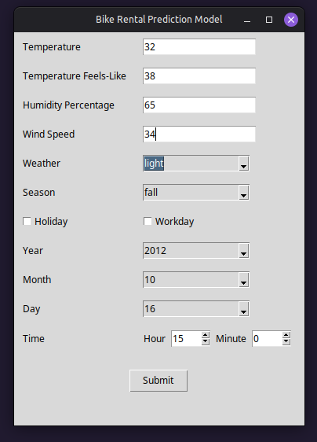
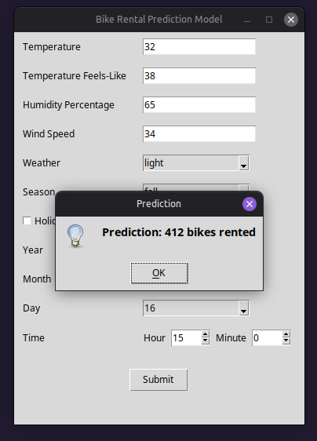

# Neural Network Bike Rental Demand Predictor

A PyTorch neural network that predicts hourly bike rental demand from weather and calendar data, with a Tkinter GUI for interactive predictions.

## Dataset and Problem

The data comes from Kaggle's [Bike Sharing Demand](https://www.kaggle.com/competitions/bike-sharing-demand/) competition: ~10,900 hourly records from a city bike-share system, each with weather conditions (temperature, feels-like temperature, humidity, wind speed, weather category), calendar context (season, holiday, working day, date/time), and the target `count` — total bikes rented that hour.

Bike-share operators need to anticipate demand to rebalance bikes across stations and manage supply. This project frames that as a regression problem: given weather and calendar conditions, predict how many rentals to expect.

## Approach

1. **Exploratory analysis** — checked for missing values and duplicates (none), then examined distributions and relationships:
   - `weather`, `holiday`, and `workingday` are heavily imbalanced (expected, since most hours are clear weather on non-holidays/workdays), while `season` is balanced.
   - `count` is strongly right-skewed; a log transform substantially reduces that skew.
   - Temperature shows a mild positive relationship with rentals (most rentals occur between roughly 20–40°C), wind speed a mild negative one, and humidity shows no clear trend except at very low values.
   - Temperature and casual (non-registered) rider counts showed a slight positive correlation; humidity showed a slight negative correlation with overall usage.

2. **Feature engineering** — one-hot encoded `weather`, `season`, `holiday`, and `workingday`, and decomposed the `datetime` column into `year`, `month`, `day`, `hour`, and `minute` so the model can learn temporal patterns without a raw timestamp.

3. **Modeling** — trained a feed-forward neural network (`BikeNN`) in PyTorch to predict `log1p(count)`, converting back with `expm1` at inference time.

4. **Hyperparameter tuning** — used Optuna (20 trials) to search learning rate, weight decay, batch size, and hidden layer sizes, with early stopping on validation loss during each trial.

5. **Final training** — retrained a model with the best-found hyperparameters, using early stopping (patience 12) on the full training run, then evaluated on the held-out test set in the original (non-log) scale.

6. **Deployment** — saved the trained model, scaler statistics, and feature names to a checkpoint, then wrapped inference in a `predict()` function and a Tkinter desktop GUI for entering inputs and viewing predictions.

## Design Decisions

- **Log-transforming the target**: `count` is right-skewed with a long tail of high-demand hours. Training on `log1p(count)` with MSE loss keeps the model from being dominated by large-count outliers and stabilizes training; predictions are converted back with `expm1`.
- **One-hot encoding over ordinal encoding**: `weather` and `season` have no meaningful numeric ordering, so one-hot encoding avoids implying a false ordinal relationship.
- **Decomposing the datetime**: rather than feeding a raw timestamp, splitting into `year`/`month`/`day`/`hour`/`minute` lets the network learn hour-of-day and seasonal effects directly, since rental patterns vary strongly by hour and month.
- **StandardScaler on inputs**: neural networks trained with Adam converge more reliably when inputs are on a similar scale, especially since features mix small percentages (humidity) with larger raw values (temperature, day of month).
- **Optuna for tuning over manual search**: with four interacting hyperparameters (learning rate, weight decay, batch size, hidden layer sizes), a Bayesian search is more sample-efficient than manual or grid search, and each trial's own early stopping keeps the search from wasting time on runs that have already converged.
- **Early stopping**: with a plain feed-forward network trained for up to 100 epochs, early stopping on validation loss avoids overfitting and cuts training time without needing to hand-tune the epoch count.
- **Tkinter for the GUI**: since this is a Python-only project with no need for web deployment, Tkinter provides a simple, dependency-light desktop interface for entering inputs and getting predictions.

## Implementation

- **`regression.ipynb`** — end-to-end notebook: EDA, preprocessing, model definition, Optuna tuning, final training, evaluation, and checkpoint export.
- **`predict.py`** — loads the saved checkpoint (`models/bike_model.pt`), reconstructs the model and scaler, and exposes a `predict(data: dict) -> int` function that takes a dict of raw feature values and returns a rounded-up rental count.
- **`Regression_GUI.py`** — a Tkinter form for entering the four continuous weather measurements, selecting weather/season/holiday/workday via dropdowns and checkboxes, and picking a date and time; on submit, it assembles the feature dict (including one-hot flags) and calls `predict()`, showing the result in a message box.

Model architecture: a 3-hidden-layer MLP (final config: input → 128 → 64 → 32 → output, ReLU activations) trained with Adam (learning rate ≈ 0.00064, weight decay ≈ 0.00065, batch size 32) and MSE loss on the log-transformed target — parameters selected by the Optuna search described above.

## Results

The final model was selected via Optuna (best validation loss ≈ 0.115 on the log scale) and trained with early stopping, converging after 92 epochs (~13 seconds of training).

On the held-out test set, converted back to the original rental-count scale:

- **RMSE:** 58.14
- **MAE:** 36.36

Training and validation loss tracked closely throughout training with no signs of major overfitting, and the largest error sources were, unsurprisingly, the highest-demand hours where rental counts spike well above their typical range.

## Demonstration

Screenshots of the GUI in use:




## Requirements

- Python 3
- `torch`, `numpy`, `pandas`, `scikit-learn`
- `seaborn`, `matplotlib`, `optuna` (for the notebook only)
- `tkinter` (for the GUI; ships with most Python installs)

## Usage

```bash
python Regression_GUI.py
```

Enter the weather measurements and calendar details, then click **Submit** to see the predicted rental count.
